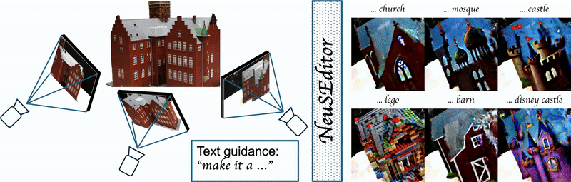

## NeuSEditor: From Multi-View Images to Text-Guided Neural Surface Edits (Official Implementation)

Project page: [https://neuseditor.github.io/](https://neuseditor.github.io/)

This repository provides the official implementation of NeuSEditor, enabling text-guided neural surface edits from multi-view images. 



### Environment

- Tested on NVIDIA RTX A6000, A100, and H100.
- Recommended: CUDA 11.8/12.1 with PyTorch 2.1, as specified in `environment.yml`.

Create the Conda environment:

```bash
conda env create -f environment.yml
conda activate neus_editor
```

Verify GPU is visible:

```bash
python -c "import torch; print(torch.cuda.is_available(), torch.version.cuda, torch.__version__)"
```

### Datasets

- NeRF-Synthetic (Blender): Download the dataset and place under `load/` so paths look like `load/nerf_synthetic/lego`  
  Link: https://drive.google.com/drive/folders/128yBriW1IG_3NJ5Rp7APSTZsJqdJdfc1

- DTU (preprocessed by NeuS): Download and use in conjunction with the DTU config  
  Link: https://drive.google.com/drive/folders/1Nlzejs4mfPuJYORLbDEUDWlc9IZIbU0C?usp=sharing

### Quick Start

Training commands (adjust flags as needed):

- NeRF-Synthetic (Blender)
```bash
python launch.py --config configs/blender.yaml --gpu 0 --train tag=example
```

- DTU
```bash
python launch.py --config configs/dtu.yaml --gpu 0 --train
```

- Example (DTU scan24, church prompt)
```bash
python launch.py --config configs/dtu.yaml --gpu 0 \
  tag=scan24_church_gs350 \
  diffusion.guidance_scale=350 \
  diffusion.tgt_prompt="make it a church" \
  dataset.root_dir=../data/DTU/scan24 \
  --train
```

- Custom COLMAP
```bash
python launch.py --config configs/colmap.yaml --gpu 0 --train
```

### Training on Custom COLMAP Data

To get COLMAP data from custom images, you should have COLMAP installed (see [here](https://colmap.github.io/install.html) for installation instructions). Then put your images in the `images/` folder, and run `scripts/imgs2poses.py` specifying the path containing the `images/` folder. For example:

```bash
python scripts/imgs2poses.py ./load/images # images are in ./load/images
```

This part is adopted from Instant-NSR-PL; please refer to that repository for detailed usage and best practices: https://github.com/bennyguo/instant-nsr-pl

### Acknowledgements

Parts of this codebase and scripts are inspired by or adapted from:

- Instant Neural Surface Reconstruction (Instant-NSR/Instant-NGP Lightning): [https://github.com/bennyguo/instant-nsr-pl](https://github.com/bennyguo/instant-nsr-pl)
- PDS: [https://github.com/KAIST-Visual-AI-Group/PDS](https://github.com/KAIST-Visual-AI-Group/PDS)
- threestudio: [https://github.com/threestudio-project/threestudio](https://github.com/threestudio-project/threestudio)

### Citation

If you find this work useful, please cite:

```bibtex
@inproceedings{ibrahimli2026neuseditor,
  title = {NeuSEditor: From Multi-View Images to Text-Guided Neural Surface Edits},
  author = {Ibrahimli, Nail and Kooij, Julian and Nan, Liangliang},
  booktitle = {International Conference on 3D Vision (3DV)},
  year = {2026}
}
```

### License

This project is released under the terms of the license found in `LICENSE`.